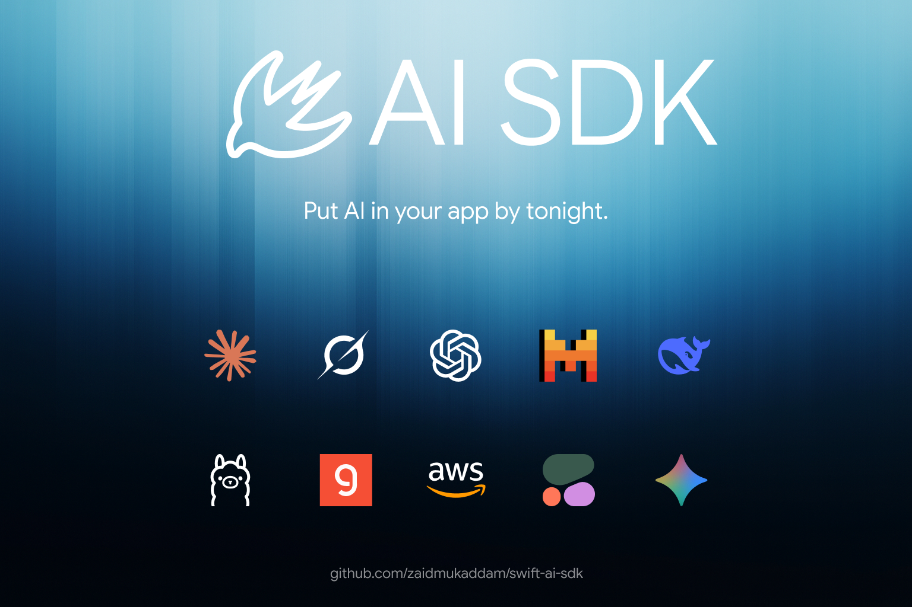
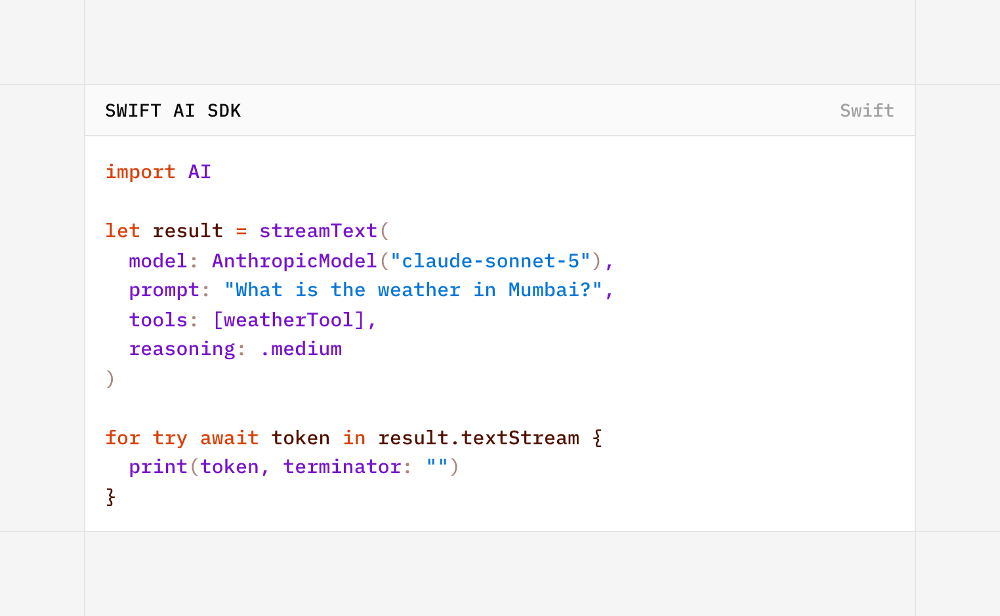

# swift-ai-sdk



Same code, on-device or cloud. swift-ai-sdk is a provider-agnostic AI toolkit for Swift, built on the Vercel AI SDK's design. You get `generateText`, `streamText`, and `generateObject`, tool calling with the agentic loop handled for you, a swappable transport layer that speaks Vercel's UI message stream protocol, and an `@Observable` chat session for SwiftUI. Swift 6 strict concurrency, `Sendable` throughout.



## Why

On-device and cloud sit behind one API. `FoundationModelsModel()` is free, private, and works offline; `AnthropicModel()` and `OpenAIModel()` are a one-line swap away, and `orFallback` picks for you based on availability.

If you already run a Vercel AI SDK backend, your Swift app can use it as-is. `HTTPChatTransport` speaks the UI message stream protocol exactly (`text-delta` with a `delta` field, `tool-input-delta` with `inputTextDelta`, `data: [DONE]`), so the same `/api/chat` route that serves your React app serves your iOS app.

And it's Swift-6-native: everything is `Sendable`, streaming is `AsyncThrowingStream`, strict concurrency is on, and there's no `@unchecked` in the public surface.

## The one abstraction

Every provider implements a single method:

```swift
protocol LanguageModel: Sendable {
    func stream(_ request: LanguageModelRequest) async throws -> AsyncThrowingStream<StreamPart, Error>
}
```

`generateText`, `streamText`, `generateObject`, and the chat transports are all just consumers of that stream. One code path, every backend.

## Tour

### Tools + the agentic loop

```swift
let weather = Tool(
    name: "weather",
    description: "Current weather for a city",
    parameters: ["type": "object", "properties": ["city": ["type": "string"]], "required": ["city"]]
) { args in
    ["tempC": 31, "city": args["city"] ?? .null]
}

let result = try await generateText(
    model: model,
    prompt: "Weather in Mumbai?",
    tools: [weather],
    stopWhen: [stepCountIs(4)],          // bound the loop (Vercel's stopWhen)
    prepareStep: { context in            // per-step overrides (model, messages, tools)
        context.stepNumber > 2 ? PrepareStepResult(model: cheaperModel) : nil
    }
)
result.text        // final answer, after the model called the tool
result.steps       // every round-trip: text, toolCalls, toolResults, usage
```

The loop streams too: `streamText(...).fullStream` yields step boundaries, tool calls, and tool results as they happen.

### Structured output

```swift
struct Recipe: Codable { var name: String; var steps: [String] }

let recipe = try await generateObject(
    model: model,
    of: Recipe.self,
    schema: [
        "type": "object",
        "properties": ["name": ["type": "string"],
                       "steps": ["type": "array", "items": ["type": "string"]]],
        "required": ["name", "steps"]
    ],
    prompt: "A simple lasagna recipe."
).object
```

Each provider uses its native mechanism: OpenAI gets `response_format: json_schema`, Anthropic a forced tool call, and Foundation Models does real constrained decoding (your JSON Schema is converted to a `GenerationSchema`). `streamObject` yields repaired partial-JSON snapshots as the object grows.

### Chat for SwiftUI

```swift
@State private var chat = ChatSession(
    transport: HTTPChatTransport(api: URL(string: "https://your-app.vercel.app/api/chat")!)
    // or: LocalChatTransport(model: FoundationModelsModel.orFallback(cloudModel))
)

ForEach(chat.messages) { message in /* message.parts: text, reasoning, tools, files, data */ }
Button("Send") { chat.send(input) }   // chat.status: .submitted -> .streaming -> .ready
```

`ChatSession` is the `useChat` analog. It drives any `ChatTransport`, reduces protocol chunks into typed `UIMessage`s (tool parts upsert by `toolCallId` through `input-streaming -> input-available -> output-available`), and updates token by token. Building a server instead? `UIMessageStream.chunks(from:)` and `UIMessageStream.encodeSSE(_:)` turn any `streamText` run into a spec-compliant response for web `useChat` clients.

### Providers

Every provider is its own pack, mirroring the `@ai-sdk/*` package family. Native wire implementations:

```swift
AnthropicModel("claude-opus-4-8")          // ANTHROPIC_API_KEY
OpenAIModel("gpt-5.6-sol")                 // OPENAI_API_KEY
XaiModel("grok-4.5")                       // XAI_API_KEY, native Responses API
GoogleModel("gemini-2.5-flash")            // GOOGLE_GENERATIVE_AI_API_KEY, native Gemini API
GroqModel("llama-3.3-70b-versatile")       // GROQ_API_KEY
DeepSeekModel("deepseek-reasoner")         // DEEPSEEK_API_KEY, streams reasoning
MistralModel("mistral-large-latest")       // MISTRAL_API_KEY
PerplexityModel("sonar")                   // PERPLEXITY_API_KEY, citations in result.sources
FoundationModelsModel()                    // Apple on-device; .privateCloudCompute() for PCC
```

Each pack pins the service's real base URL, reads the same environment variable the AI SDK uses, and decodes that provider's quirks: xAI speaks the Responses API by default (`XaiModel.chat(...)` for the legacy path) with url-citation sources; Groq and DeepSeek stream thinking into `reasoningText`; Perplexity's consulted URLs land in `result.sources`. Provider-specific knobs (`search_parameters`, `reasoning_format`, `safe_prompt`, ...) pass through `providerOptions`.

Services whose upstream packages wrap `@ai-sdk/openai-compatible` do the same here via `OpenAICompatibleProvider` factories: Together, Fireworks, Cerebras, OpenRouter, Ollama, LM Studio.

```swift
let local = OpenAICompatibleProvider.ollama()("llama3.3")  // no key needed

// Custom gateways get the full config surface, like createOpenAICompatible:
let gateway = OpenAICompatibleProvider(
    name: "my-gateway",
    baseURL: URL(string: "https://llm.your-company.com/v1")!,
    apiKey: key,
    headers: ["x-team": "ios"],
    queryParams: ["api-version": "2026-01-01"]
)
let result = try await generateText(model: gateway("my-model"), prompt: "Hi")
```

### Embeddings

```swift
let model = OpenAIEmbeddingModel("text-embedding-3-small")  // key from OPENAI_API_KEY
let docs = try await embedMany(model: model, values: texts)
let score = cosineSimilarity(docs.embeddings[0], docs.embeddings[1])

// Providers vend embedding models too:
let bge = OpenAICompatibleProvider.togetherAI().textEmbeddingModel("BAAI/bge-large-en-v1.5")
```

## What's in the box (v0.1)

Every AI SDK primitive: `generateText` and `streamText` with the multi-step
tool loop; `generateObject` / `streamObject` with all four output strategies
(object, array via `elementStream()`, `generateEnum`, `generateJSON`);
`embed` / `embedMany` / `cosineSimilarity`; `rerank`; `generateImage`
(including edits), `generateSpeech`, `transcribe`, and `generateVideo`;
`Agent` (the `ToolLoopAgent` analog, which is also a `ChatTransport`);
middleware via `wrapLanguageModel` (including a response `cache`,
`extractReasoning`, and `defaultSettings`); `ProviderRegistry` for
"provider:model" lookup; `MCPClient` for Model Context Protocol tools;
file uploads; realtime voice sessions (OpenAI, Google, xAI) with
client-side tool calling; telemetry hooks with the
AI SDK's span names; the `Schema` DSL (the zod analog: combinators that
emit JSON Schema and validate output at runtime); and the full hook family
as `@Observable` sessions: `ChatSession` (`useChat`), `CompletionSession`
(`useCompletion`), `ObjectSession` (`useObject`).

The full loop-control and tool surface: `toolChoice`, `activeTools`,
`toolOrder`, `stopWhen` (`isStepCount`, `isLoopFinished`, `hasToolCall`),
`prepareCall` (whole-call) and `prepareStep` (per-step), `onStepFinish` /
`onFinish` / `onError`, typed tool arguments, provider-executed tools
(`<Model>.Tools`), client-side tools (no executor) with
`ChatSession.addToolResult`, and tool approvals (`needsApproval`) with
`ChatSession.addToolApprovalResponse`. Sampling settings (temperature, topP,
topK, penalties, seed) map to each wire where supported.

Multimodal messages (`ContentPart.image` / `.file`) reach every provider in
its native shape, reasoning streams surface as `reasoningText`, and citations
surface as `result.sources`.

Providers: native packs for OpenAI (Responses API default), Anthropic, xAI
(Responses default, plus video), Google (Gemini wire), Google Vertex, Amazon
Bedrock (Converse over AWS event stream), Cohere (chat, embeddings, rerank),
Groq, DeepSeek, Mistral, and Perplexity; `AzureOpenAIProvider`; compat
factories for Together, Fireworks, Cerebras, OpenRouter, DeepInfra, Baseten,
Vercel, Gateway, Ollama, LM Studio, and Sarvam (Indic reasoning chat); and
Apple Foundation Models on-device with Private Cloud Compute. Media packs:
OpenAI, ElevenLabs, LMNT, Hume, Deepgram, and Sarvam (Bulbul) speech; OpenAI,
ElevenLabs, Deepgram, AssemblyAI, Rev.ai, Gladia, and Sarvam (Saaras)
transcription; OpenAI, fal, Luma, and Replicate images; Luma and xAI video.

Provider-executed (server-side) tools have typed builders under `<Model>.Tools`
— xAI live/X search and code execution, OpenAI web/file search and code
interpreter, Google grounding, and Anthropic web search, code execution,
computer use, and more (with `anthropic-beta` headers handled for you). They
surface as provider-executed `.toolCall` / `.toolResult` parts.

Route layer: `UIMessage`, the chunk codec, the reducer,
`HTTPChatTransport` / `LocalChatTransport`, the server bridge, and
`ChatSession` (`@Observable`, iOS 17+/macOS 14+).

376 unit tests, including wire-format goldens validated against the `ai`
package's own zod schemas; no network, no API keys. A separate `AITesting`
library ships the mock models and stream simulators (the `ai/test` analog)
for your own test targets. The full feature-by-feature comparison lives in
[PARITY.md](PARITY.md).

## Test apps

Two real iOS apps live in [Apps/](Apps/), verified on the iOS 27 simulator
with Xcode 27. Generate the project with [xcodegen](https://github.com/yonaskolb/XcodeGen)
and run them from Xcode, or drive the simulator from the shell:

```bash
cd Apps
xcodegen generate            # produces SwiftAIApps.xcodeproj
open SwiftAIApps.xcodeproj   # run StreamTextDemo or RealtimeDemo on a simulator
```

StreamTextDemo is a chat UI over `streamText` with the tool loop, talking
to local Ollama (the simulator shares the Mac's loopback, so no setup).
RealtimeDemo is a voice UI over `RealtimeSession`: pick xAI, OpenAI, or
Google, paste an API key (or export it), and it speaks through your
speakers, streams your microphone, transcribes both sides, and runs a
client-side tool.

Both apps also take a `--smoke` launch argument for scripted,
self-verifying runs, and the same sources double as macOS windows via
`swift run StreamTextDemo` / `swift run RealtimeDemo` from `Apps/`.

## Agent skill

Building with a coding agent (Claude Code, Cursor, ...)? Install the skill so
it writes correct swift-ai-sdk code instead of guessing:

```bash
npx skills add zaidmukaddam/swift-ai-sdk
```

It ships a `SKILL.md` router plus a `references/` tree — one file per topic
(text, structured output, tools, agents, providers, middleware, chat UI,
realtime, media, on-device, testing) — so the agent opens only what it needs.
The skill lives at [skills/swift-ai-sdk/](skills/swift-ai-sdk/) and is verified
against the source.

## Docs site

A landing page and full documentation live in [site/](site/), built on
Next.js and fumadocs (notebook layout):

```bash
cd site
pnpm install
pnpm dev
```

The docs cover the whole surface, each page also served as raw markdown for
LLMs via `/llms.txt` and per-page `.mdx` routes. An **Ask AI** chatbot (xAI
via the Vercel AI SDK, grounded on the docs) answers questions in-page — set
`XAI_API_KEY` to enable it.

## Wire compatibility

The transport layer is pinned against the AI SDK v5+ UI message stream protocol, checked against the `ai` package source (v7):

- SSE frames: `data: {"type": ...}\n\n`, terminated by `data: [DONE]`
- `text-start` / `text-delta` (field `delta`) / `text-end`, keyed by `id`
- `tool-input-start` -> `tool-input-delta` (field `inputTextDelta`) -> `tool-input-available` -> `tool-output-available` / `tool-output-error`, upserted by `toolCallId`
- Hyphenated finish reasons (`tool-calls`, `content-filter`)
- Request body: `{ id, messages, trigger, messageId }`
- Response headers: `x-vercel-ai-ui-message-stream: v1`

## Roadmap

- `@Generable`-style macro: JSON Schema from a Swift struct
- MLX provider (local weights on Apple silicon)
- Streaming markdown view

## Install

```swift
.package(url: "https://github.com/zaidmukaddam/swift-ai-sdk.git", from: "0.1.0")
```

Then add `"AI"` to your target's dependencies. Requires Swift 6 / Xcode 16+. The Foundation Models provider activates automatically when built with the iOS 26 / macOS 26 SDK.

## Test

```bash
swift test      # 376 tests: loop, wire-format goldens, reducer, transports. No API keys needed.
swift run demo  # live smoke test; set ANTHROPIC_API_KEY, OPENAI_API_KEY, or OLLAMA_MODEL
```

## License

MIT
